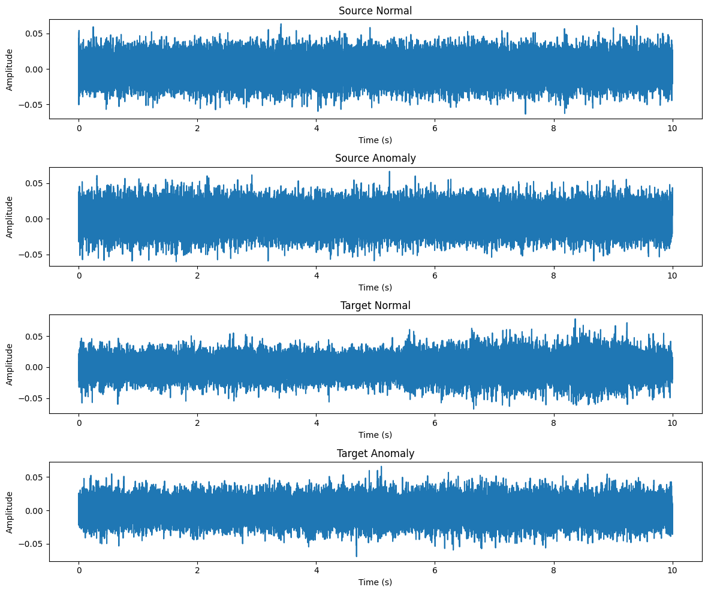
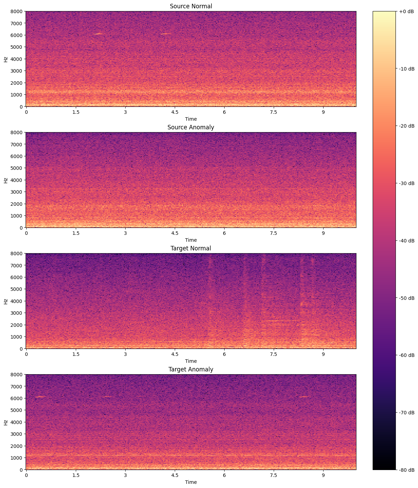

# Industrial Acoustic Condition Monitoring

## Objective

This project investigates acoustic anomaly detection for industrial machines using signal processing, machine learning, CNN autoencoders, and few-shot domain adaptation.

The experiments are conducted on the MiMII DUE fan dataset, with a focus on source-to-target domain shift and three-shot target-domain adaptation.

## Dataset

MIMII-DUE fan dataset.

Three sections were used:

- Section 00
- Section 01
- Section 02

Each section contains:

- Source-domain normal training data
- Target-domain 3-shot normal training data
- Source-domain test data
- Target-domain test data

### Example Acoustic Signals

The following figures show examples of the acoustic data used in this project.

#### Time-domain waveform

Example waveform of a fan recording in the time domain.

#### Mel spectrogram

Example Mel spectrogram of a fan recording, showing the distribution of acoustic energy across frequency and time.

## Methods

### Classical baselines

- Isolation Forest
- One-Class SVM

### Deep learning

- CNN Autoencoder

## Acoustic Features

- RMS
- Zero Crossing Rate
- Spectral Centroid
- Spectral Bandwidth
- Spectral Rolloff
- Spectral Flatness

## Experiments

1. Source → Source
2. Source → Target
3. Source + 3 Target → Target

## Evaluation

- Accuracy
- Precision
- Recall
- F1-score
- Confusion Matrix